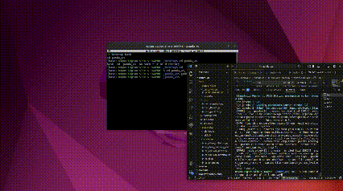

# Franka Panda Color Sorting Robot (ROS 2 Humble • Ubuntu 22.04 • Gazebo Sim)

A ROS 2 Humble simulation project for the **Franka Emika Panda** that detects **Red / Green / Blue** objects from a camera feed and performs a **pick-and-place / sorting** sequence using **MoveIt 2** and **ros2_control** in **Gazebo Sim (Ignition/GZ)**.

> **Platform:** Ubuntu 22.04 + ROS 2 Humble (no Docker / no Windows)

---

## Demo

Add your demo here:

Example:



---

## Features

- ✅ Gazebo Sim Panda robot scene
- ✅ ros2_control controllers:
  - `joint_state_broadcaster`
  - `arm_controller` (JointTrajectoryController)
  - `gripper_controller` (JointTrajectoryController)
- ✅ MoveIt 2 motion planning + trajectory execution
- ✅ OpenCV-based color segmentation (HSV) for **R/G/B**
- ✅ Publishes target coordinates on `/color_coordinates`
- ✅ Pick-and-place node selects target color using a ROS parameter

---

## Requirements

- Ubuntu **22.04**
- ROS 2 **Humble**
- MoveIt 2 (Humble)
- Gazebo Sim + ROS bridge (`ros_gz`)
- OpenCV + `cv_bridge`
- TF2

---

## Installation

### 1) Source ROS 2 Humble

```bash
source /opt/ros/humble/setup.bash
```

### 2) Install dependencies

> Package names can vary slightly by distro updates; this is the typical set for Humble.

```bash
sudo apt update
sudo apt install -y   python3-colcon-common-extensions   python3-rosdep   python3-vcstool   python3-opencv   python3-numpy   ros-humble-cv-bridge   ros-humble-tf2-ros   ros-humble-tf-transformations   ros-humble-moveit   ros-humble-ros-gz-sim   ros-humble-ros-gz-bridge   ros-humble-gz-ros2-control
```

Initialize `rosdep` if needed:

```bash
sudo rosdep init || true
rosdep update
```

---

## Build

From the workspace root:

```bash
cd ~/panda_ws
rosdep install --from-paths src -i -y --rosdistro humble
colcon build --symlink-install
source /opt/ros/humble/setup.bash
source ~/panda_ws/install/setup.bash
```

---

## Quick Start

### 1) Launch simulation + MoveIt + controllers

Use your bringup launch file (example name shown):

```bash
source /opt/ros/humble/setup.bash
source ~/panda_ws/install/setup.bash

ros2 launch <your_bringup_package> pick_and_place.launch.py
```

If you run everything separately, ensure these are up and running:

- Gazebo Sim world
- `controller_manager` and controllers active
- `move_group` running
- camera topics publishing

### 2) Verify camera topics

```bash
ros2 topic list | grep -E "camera|image"
ros2 topic info /camera/image_raw
```

Expected (example):

- `/camera/image_raw`
- `/camera/camera_info`

### 3) Start color detection

```bash
source /opt/ros/humble/setup.bash
source ~/panda_ws/install/setup.bash

ros2 run panda_vision color_detector
```

This should open an OpenCV window and publish detections on `/color_coordinates`.

Check:

```bash
ros2 topic echo /color_coordinates
```

### 4) Run pick-and-place

Target color options:

- `R` = Red
- `G` = Green
- `B` = Blue

If your script is registered as a ROS executable:

```bash
ros2 run pymoveit2 pick_and_place.py --ros-args -p use_sim_time:=true -p target_color:=R
```

If `ros2 run` can’t find it, run it by full path:

```bash
~/panda_ws/install/pymoveit2/lib/pymoveit2/pick_and_place.py --ros-args -p use_sim_time:=true -p target_color:=R
```

---

## ROS Topics

### Inputs

- `/camera/image_raw` (`sensor_msgs/msg/Image`)
- `/camera/camera_info` (`sensor_msgs/msg/CameraInfo`)
- `/joint_states` (`sensor_msgs/msg/JointState`)

### Outputs

- `/color_coordinates` (`std_msgs/msg/String`)

Message format:

```text
<COLOR>,<X>,<Y>,<Z>
```

Example:

```text
R,0.600,0.002,1.100
```

---

## Parameters

### `panda_vision/color_detector`

Typical parameters (depending on your implementation):

- `image` (topic remap) — default `/camera/image_raw`
- HSV thresholds (often set inside the script)
- camera intrinsics (fx, fy, cx, cy)
- frame IDs (`camera_link`, `panda_link0`)

### `pick_and_place.py`

- `target_color` (`R`/`G`/`B`)
- `use_sim_time` (`true` when using Gazebo simulation)

Example:

```bash
ros2 run pymoveit2 pick_and_place.py --ros-args -p use_sim_time:=true -p target_color:=G
```

---

## Troubleshooting

### 1) OpenCV window not showing

- Make sure you are running on a desktop session with display:
  ```bash
  echo $DISPLAY
  ```
- If you are on Wayland and OpenCV windows behave oddly, try logging into an **Xorg** session.
- If using SSH, you’ll need X-forwarding or run locally.

### 2) NumPy / cv_bridge import errors

Errors like:

- `_ARRAY_API not found`
- “compiled with NumPy 1.x cannot be run in NumPy 2.x”
- `np.maximum_sctype was removed`

Usually means `pip`/`conda` NumPy is overriding the system NumPy expected by ROS packages.

Recommended fix:

```bash
python3 -m pip uninstall -y numpy opencv-python opencv-contrib-python || true
sudo apt install --reinstall -y python3-numpy python3-opencv ros-humble-cv-bridge
```

Verify:

```bash
python3 -c "import numpy as np; print(np.__version__); print(np.__file__)"
python3 -c "import cv_bridge; print('cv_bridge OK')"
```

### 3) MoveIt execution aborts (`STATUS_ABORTED`)

This means execution was aborted (timing/constraints/controller). Common fixes:

- Increase max velocity/acceleration slightly in the pick node (e.g. `0.2`)
- Verify controllers are active:
  ```bash
  ros2 control list_controllers
  ```
- Check `/move_group` terminal output at the exact abort moment for the real reason.

### 4) Joint states “not available yet” warnings

If your node starts planning before it receives `/joint_states`, you may see warnings. Confirm joint states are publishing:

```bash
ros2 topic hz /joint_states
```

If using Gazebo:
- ensure `use_sim_time:=true` for nodes that need simulation time
- ensure controller manager and joint_state_broadcaster are active

### 5) `ros2 run ... No executable found`

`ros2 run` only finds executables installed into:

```text
install/<pkg>/lib/<pkg>/
```

If your script is just a file in `src/`, run it by full path or register it as a `console_scripts` entry in an ament_python package.

---

## Development Notes

- Keep all commands consistent with your environment:
  ```bash
  source /opt/ros/humble/setup.bash
  source ~/panda_ws/install/setup.bash
  ```
- Avoid mixing Conda Python with ROS runtime unless you intentionally isolate it.

---

## License

MIT License — see `LICENSE`.

---

## Author

GitHub: **UdayRockzz**
